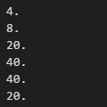
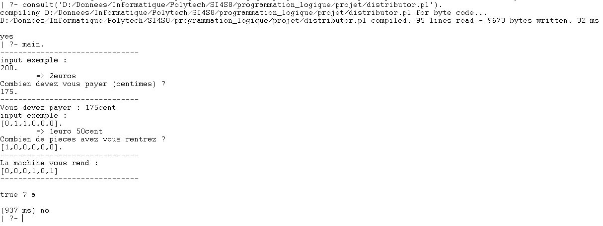
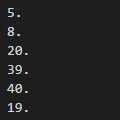

# SI4 : Programmation logique - Distributeur automatique

## Auteur
[Pierre RAINERO](pierre.rainero@hotmail.fr)

## Source 
Ce projet est une solution et une extension du problème posé sur le site de [Christine Solnon](https://perso.liris.cnrs.fr/christine.solnon/Site-PPC/session6/e-miage-ppc-sess6.htm#exo_1).

## Distributeur automatique
Il est fréquent d'utiliser un distributeur automatique (pour acheter des boissons ou de la nourriture par exemple), mais vous-êtes-vous déjà posé la question sur la manière dont est rendue la monnaie ? Il est fréquent que ces distributeurs arrivent à cours de certaines pièces car elles rendent par défaut le maximum de petites pièces par exemple.   
Ce projet a pour but de reproduire le mécanisme d'un monnayeur automatique et d’optimiser le choix des pièces en en rendant le moins possible.   
Pour se faire, le projet s'appuie sur un langage de programmation logique, plus précisément par contraintes pour ce problème : **Prolog**. La quantité de pièces disponible dans le distributeur est mockée par le fichier _quantities.txt_ qui est construit sous la forme suivante :    
       

## Utilisation
Pour utiliser le projet il suffit de disposer du **compilateur Prolog** (GNU-Prolog), de **charger le code _distributor_** et de lancer le **paquet _main_** avec la commande `main.`.   
Le programme interagira  alors avec vous au travers du terminal, il vous demandera d'entrer la somme à payer et les pièces que vous utilisez pour payer (`[Nombre de pièces de 2€, De 1€, De 50cent, De 20cent, De 10cent, De 5cent].`) :   
      
Le fichier _quantities.txt_ sera alors mis à jours :    
  
